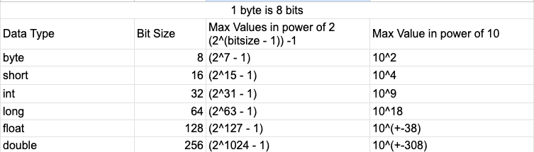

# Tinkering_With_Code

a.k.a my learning journal.

## Table of Contents

## System Design
____

[Scale from Zero to Million Users](theory/SystemDesign/HLD/Alex-Xu-Vol1/chapter01/README.md)

## DSA
____

##### Significance of constraints
[Notes Link](theory/dsa/SignificanceInConstraints.md)

##### Random Necessary Tidbits

```
In Java, things are strictly Pass By Value 
(for objects, Pass BY VALUE occurs and it means that REFERENCE is passed as VALUE.)

Pass By Reference :
Scenario --- If teacher has given his original class notes doc to a student, 
any changes he makes there will reflect in others who have the sheet.

Pass By Value :
Scenario --- If teacher has given his printout of Original class notes doc to a student, 
any changes he makes there will reflect in others who have the sheet.


Pass By Reference, happens in C with the help of pointers.

```
* Auxiliary space complexity : refers to the extra space or memory required by an algorithm apart from the input size.
* To reduce the size of number to fit the integer bit range, we use number % MOD where mod = (int) 1e9 + 7;
```
Integer.MAX_VALUE -> (2^31-1 = 2147483647)
Integer.MIN_VALUE -> (-2^31 = -2147483648)
```


* Combination Formula


* Permutation Formula


___

### Recursion

[Intro to Recursion](theory/dsa/Recursion/Recursion.md)
##### Types :-
> Divide and Conquer

* [Count Good Numbers](theory/dsa/Recursion/CountGoodNumbers.md)

> Backtracking   
* Understand this pattern
* [Combination Sum 1](theory/dsa/Recursion/CombinationSum.md) 
* Subset Sum 1 

> Generic Recursion

* [String to Integer (atoi)]()
* [Pow(x, n)](theory/dsa/Recursion/pow_x_n.md)
* [Generate All Binary Strings except consecutive ones](https://www.geeksforgeeks.org/generate-binary-strings-without-consecutive-1s/?utm_source=youtube&utm_medium=collab_striver_ytdescription&utm_campaign=generate-binary-strings-without-consecutive-1s)

___

### Arrays

> Famous Problems / One-Ofs

* [Sort Arrays of 0s, 1s and 2s](theory/dsa/Array/Sort_Arrays_Of_0s_1s_2s_(Dutch_National_Flag_Algorithm).md)
* [Stock Buy and Sell](src/main/java/com/hobbyprojects/tinkeringwithcode/dsa/arrays/medium/StockBuyAndSell.java)
* [Next Permutation](theory/dsa/Array/NextPermutation.md)
* [Pascal's Traingle](/theory/dsa/Array/Pascal'sTriangle.md)
* Count reverse pairs
* Count inversions
* Find the Union

> Longest Subarray / Maximum Subarray

* [Longest subarray with given sum K(positives)](theory/dsa/Array/Subarray.md)
* [Longest subarray with sum K (Positives + Negatives)](theory/dsa/Array/Subarray.md)
* [Longest Consecutive Sequence In An Array](src/main/java/com/hobbyprojects/tinkeringwithcode/dsa/arrays/medium/LongestConsecutiveSequence.java)
* [Find maximum sum for subarray](theory/dsa/Array/Subarray.md)

> Matrix Related

* [Set Matrix Zeroes](theory/dsa/Array/Matrix.md)
* [Spiral Traversal Of Matrix](theory/dsa/Array/Matrix.md)
* [Rotate Image by 90 degrees](theory/dsa/Array/Matrix.md)

> Sorting

* Largest Element in an Array
* Check if the array is sorted
* Check if array is sorted and rotated
* Remove duplicates from Sorted array (in-place)
* [Second-Largest Element in an Array without sorting](theory/dsa/Array/SecondLargestAndSmallestElementWithoutSorting.md)

> Array Rotation

* Left Rotate an array by one place
* Left rotate an array by D places

> Rearranging Elements

* Move Zeros to end
* [Rearrange elements by sign](theory/dsa/Array/RearrangeElementsBySign.md)

> Searching / Finding certain elements or patterns

* Linear Search
* Maximum Consecutive Ones
* Find the number that appears once, and other numbers twice.
* Find missing number in an array
* Find-the-repeating-and-missing-numbers
* Leaders in an array

___

### Sorting

* [Selection Sort](/theory/dsa/Sorting/SelectionSort.md)
* [Bubble Sort](/theory/dsa/Sorting/BubbleSort.md)
* [Insertion Sort](/theory/dsa/Sorting/InsertionSort.md)
* [Merge Sort](theory/dsa/Sorting/MergeSort.md)
* [Quick Sort](theory/dsa/Sorting/QuickSort.md)

___

### Sliding Window / Two-Pointer Problems

* two-sum-check-if-a-pair-with-given-sum-exists-in-array
* union-of-two-sorted-arrays
* 3-sum-find-triplets-that-add-up-to-a-zero
* 4sum
* Container with most water (two pointer / greedy)

___

### Bit Manipulation -- Low Priority

    * [base 2 and base 10 conversion of a number]()
    * 1s and 2s Compliment
    * Must know tricks in Bit Manipulation
    * Minimum Bit Flips to convert number
    * Power Set
    * Single Number 1
    * Single Number 2
    * Single Number 3
    * XOR of numbers of given range
    * Divide two integers without using multiplication and division operators

### Miscellaneous

##### Java

* Java 8 Features
    * [Streams](/theory/dsa/FunctionalProgramming/Streams.md) (In-progress)
      Progress)
    * Optional (TODO)

* Design Patterns (TODO)

##### Templates

* [Boilerplate Code For DSA](templates/BolierplateCode.md)
* [Boilerplate for Notes](templates/v1_TemplateforDSANotes.md)

##### DSA Sheet For Tracking Progress

* [Progress Tracker](https://docs.google.com/spreadsheets/d/1eOiocrhZYlWQHIePjip2fmdI0QLYoRncZ6so_8fcr7g/edit#gid=0)
* [DSA Topics](https://docs.google.com/spreadsheets/d/1eOiocrhZYlWQHIePjip2fmdI0QLYoRncZ6so_8fcr7g/edit#gid=1325411286)
* [Patterns found in DSA problems](https://docs.google.com/spreadsheets/d/1eOiocrhZYlWQHIePjip2fmdI0QLYoRncZ6so_8fcr7g/edit#gid=96114204)

##### Resources to be referred :

https://leetcode.com/discuss/interview-question/5366542/all-leetcode-articles-on-coding-patterns-summarized-in-one-page