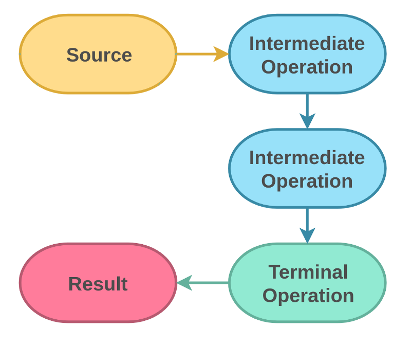

## Checklist for Streams




> Talk is cheap show me the code :) ->
[Source Code](/src/main/java/com/hobbyprojects/tinkeringwithcode/util/StreamsUtil.java)

## Intermediate Operations

### Filtering :

* ``` filter(Predicate<? super T> predicate)```
* ``` distinct()```

### Map :

* ```map()```
* mapToInt() (TODO)
* flatMap() (TODO)

### Sizing / Sorting (TODO)

* skip(long n)
* limit(long maxSize)
* sorted()
* sorted(Comparator<? super T> comparator)*

### Debugging (TODO)

* peek(Consumer<? super T> action)

## Terminal Operations (TODO)

Aggregate to new collection/array

R collect(Collector<? super T, A, R> collector)
R collect(Supplier<R> supplier, BiConsumer<R, ? super T> accumulator, BiConsumer<R, R> combiner)
Object[] toArray()
A[] toArray(IntFunction<A[]> generator)
Reduce to a single value

T reduce(T identity, BinaryOperator<T> accumulator)
Optional<T> reduce(BinaryOperator<T> accumulator)
U reduce(U identity, BiFunction<U, ? super T, U> accumulator, BinaryOperator<U> combiner)
Calculations

Optional<T> min(Comparator<? super T> comparator)
Optional<T> max(Comparator<? super T> comparator)
long count()
Matching

boolean allMatch(Predicate<? super T> predicate)
boolean anyMatch(Predicate<? super T> predicate)
boolean noneMatch(Predicate<? super T> predicate)
Finding

Optional<T> findAny()
Optional<T> findFirst()
Consuming

void forEach(Consumer<? super T> action)
void forEachOrdered(Consumer<? super T> action)

### References:

[Article reference](https://belief-driven-design.com/functional-programming-with-java-streams-190eda591a5/)

[Video Reference]()
