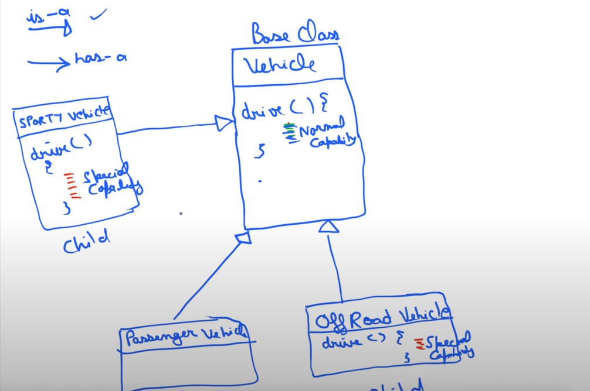

## Strategy Design Pattern 


#### **Vehicle Class : Responsibilities**
```java
drive()
display() 
seatingCapacity() 
```

#### **Conclusion from diagram**
In the above diagram, there are 3 vehicle (child classes) inheriting from the parent Vehicle class. 

* Sporty Vehicle : 
    * drive() : can use a special type of engine
    * display() : can have an analog display 
    * seatingCapacity() : can be a 4 seater  

* OffRoad vehicle : can use a special type of engine
    * drive() : can use a special type of engine
    * display() : can have an analog display 
    * seatingCapacity() : can be a 4 seater 

* Passenger vehicle : uses a normal engine 
    * drive() : can use a special type of engine
    * display() : can have an digital display
    * seatingCapacity() : can be a 4 seater

#### **Why do we need a design pattern here?**
On observing closely, we find that there's a lot of repeated code between _Sporty vehicle_ and _Offroad vehicle_.
Hence we use strategy pattern here. 

_____

