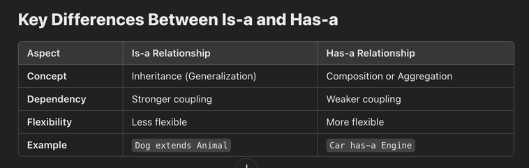

### **1. Is-a Relationship (Inheritance)**

This represents inheritance in object-oriented programming. When a class is a specialized version of another class, it forms an "is-a" relationship.

### **Implementation**
The `is-a` relationship is achieved using the `extends` keyword for classes or `implements` for interfaces.

### **Purpose**
To establish a parent-child hierarchy where the subclass inherits fields and methods from the superclass.

### **Example**
```java
class Animal {
    void eat() {
        System.out.println("This animal eats food.");
    }
}

class Dog extends Animal {
    void bark() {
        System.out.println("Dog barks.");
    }
}

public class Main {
    public static void main(String[] args) {
        Dog dog = new Dog();
        dog.eat(); // Inherited behavior
        dog.bark(); // Specialized behavior
    }
}
```

### **Has-a Relationship in Java**

The **has-a** relationship in Java represents a "uses" or "owns" relationship between classes. This is also known as **Composition** or **Aggregation** in object-oriented programming. It allows one class to contain a reference to another class as a field, indicating that one object "has-a" instance of another object.

---

### **Implementation**

The `has-a` relationship is implemented by including an instance of one class as a field within another class.

---

### **Purpose**

The purpose of the `has-a` relationship is to:
1. Represent relationships where one class is part of another.
2. Allow one class to use the functionality or services of another class.

---

### **Example**

```java
class Engine {
    void start() {
        System.out.println("Engine starts.");
    }
}

class Car {
    private Engine engine;

    Car() {
        this.engine = new Engine(); // Composition
    }

    void startCar() {
        engine.start();
        System.out.println("Car is running.");
    }
}

public class Main {
    public static void main(String[] args) {
        Car car = new Car();
        car.startCar(); // Car "has-a" Engine
    }
}
```