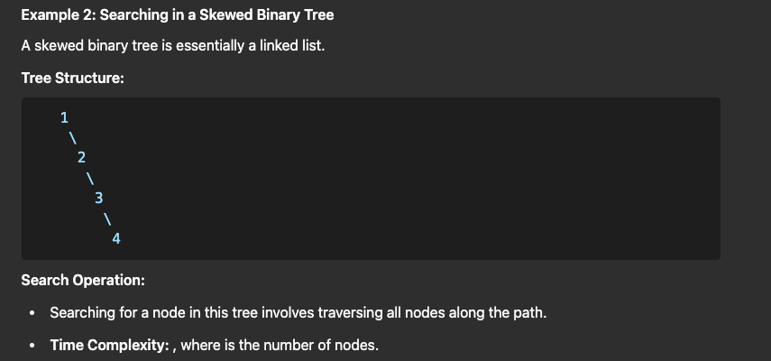

[Created with Kunal Kushwaha Playlist + ChatGpt](https://www.youtube.com/watch?v=4s1Tcvm00pA)

### Binary Tree
It has two nodes. Generally, it takes O(log N) time complexity to search/insert/delete an element 

### Types of Binary Tree

##### **Balanced Tree**
A balanced binary tree ensures that the height difference between the left and right subtrees of any node is at most 1.

Example:
```
    10
   /  \
  5    20
 / \   / \
3   7 15  25

In this tree, the height of the left subtree (2) and the right subtree (2) of the root node (10) differ by at most 1, making it a balanced binary tree.
```


##### **Full Binary Tree**
A full binary tree is one where every node has either 0 or 2 children. No node has only one child.

Example:
```
    10
   /  \
  5    20
 / \   / \
3   7 15  25
```
##### **Complete Binary Tree**
A complete binary tree is one where all levels are completely filled except possibly the last level, which is filled from left to right.

Example:
```
    10
   /  \
  5    20
 / \   /
3   7 15

This tree is complete because all levels are filled except the last, and the nodes in the last level (15) are filled from left to right.

```

##### **Perfect Binary Tree**
A perfect binary tree is one where all internal nodes have two children, and all leaf nodes are at the same level.

Example:
```
    10
   /  \
  5    20
 / \   / \
3   7 15  25

In this tree, all internal nodes (10, 5, 20) have two children, and all leaf nodes (3, 7, 15, 25) are at the same level, making it a perfect binary tree.
```

### Limitations of Binary Tree

##### Searching in an Unbalanced Binary Tree
If the tree is unbalanced (e.g., a skewed tree where all nodes are in a single path), a search operation may take `O(N)` time.

##### Examples

- **Search in a Skewed Tree**:
  Traverses all nodes sequentially if the tree is skewed, resembling a linked list.



______

### Where Are Trees Used?

##### 1. **Data Storage and Retrieval**
- **Binary Search Trees (BSTs)**: Efficient for searching, inserting, and deleting elements with `O(log N)` average time complexity.

##### 2. **Hierarchical Data Representation**
- **File Systems**: Represent directories and files in an operating system.

##### 3. **Database Management**
- **B-Trees and B+ Trees**: Used in database indexing to allow efficient query processing.

##### 4. **Compression Algorithms**
- **Huffman Trees**: Used in data compression algorithms to minimize the storage or transmission size of data.

______

### Terminologies used : 
##### 1. **Node**
The basic unit of a binary tree containing a value and references to its left and right children.

##### 2. **Root**
The topmost node in the tree, serving as the starting point for traversals.

##### 3. **Parent**
A node that has one or more children. For example, in a binary tree, each node (except the root) has a single parent.

##### 4. **Child**
A node that is directly connected to another node (its parent) in the downward direction.

##### 5. **Leaf**
A node with no children (both left and right child references are `null`).

##### 6. **Subtree**
A portion of the tree that consists of a node and all its descendants.

##### 7. **Height**
The length of the longest path from a node to a leaf. The height of the tree is the height of the root node.

##### 8. **Depth**
The distance (number of edges) from the root to a particular node.

##### 9. **Level**
The nodes at a specific depth. The root is at level 0, its children at level 1, and so on.

##### 10. **Degree**
The number of children a node has. In a binary tree, the degree is at most 2.

##### 11. **Traversal**
The process of visiting all nodes in a tree in a specific order:
- **In-order**: Left → Root → Right
- **Pre-order**: Root → Left → Right
- **Post-order**: Left → Right → Root
- **Level-order**: Visit nodes level by level.
