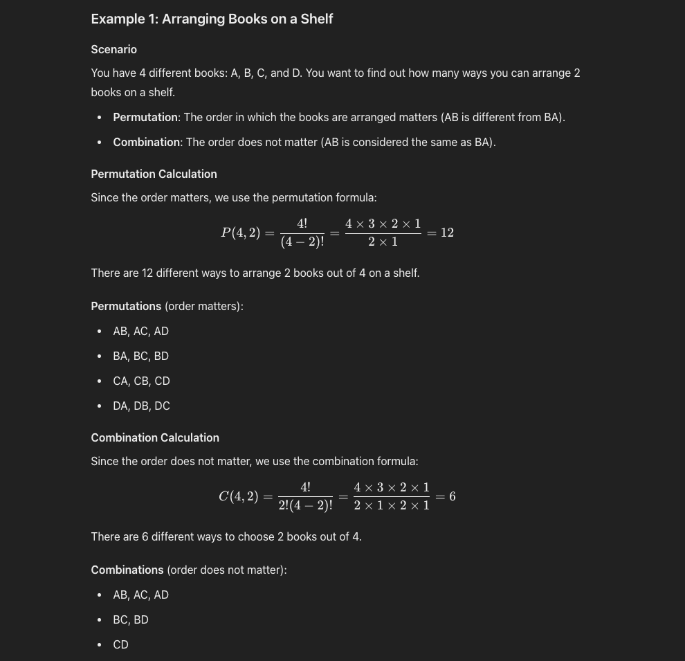

##### Combinatorics :
The formula used to calculate the number of anagrams for each word in the string is not directly the standard permutation or combination formula because it deals specifically with the permutations of items **with repetitions**. Here’s why it is distinct from the typical permutation or combination formulas:

### 1. **Difference from Permutations without Repetition**

- **Permutations without Repetition**: When you calculate permutations without repetition, you are considering arrangements of distinct items where the order matters. The formula for this is:

\[
P(n) = n!
\]

This formula calculates the number of ways to arrange \(n\) distinct items.

- **Permutations with Repetition**: In our case, we have words with repeated letters, such as "too". For these words, the permutations would consider repeated letters indistinguishable from each other, which is why we divide by the factorials of the counts of the repeated letters.

For example, for the word "too":
- Total letters: 3 (t, o, o)
- Number of permutations if all were distinct: \(3!\)
- Adjust for repetition of 'o': divide by \(2!\)

Thus, the formula used is:

\[
\text{Number of anagrams} = \frac{n!}{n_1! \times n_2! \times \ldots \times n_k!}
\]

where:
- \(n!\) is the factorial of the total number of letters in the word,
- \(n_1!, n_2!, \ldots, n_k!\) are the factorials of the frequencies of each unique letter.

### 2. **Difference from Combinations**

- **Combinations**: Combinations are used when the order of selection does not matter, and you are choosing a subset of items from a larger set. The formula for combinations is:

\[
C(n, r) = \frac{n!}{r! \times (n-r)!}
\]

This is used when you want to select \(r\) items from \(n\) without regard to the order.

- **Anagrams vs. Combinations**: In the context of anagrams, order **does** matter within each word because rearranging the letters forms different valid anagrams. Therefore, anagrams involve permutations of letters within each word rather than combinations.

### Why the Specific Formula for Anagrams?

The specific formula used for calculating anagrams with repeated characters is derived from the need to handle indistinguishable items (repeated letters) appropriately. This formula ensures that permutations are counted correctly by accounting for repetitions:

\[
\text{Number of anagrams} = \frac{n!}{n_1! \times n_2! \times \ldots \times n_k!}
\]

where:
- \(n\) is the total number of letters in the word,
- \(n_1, n_2, \ldots, n_k\) are the counts of each distinct letter.

### Summary:

The formula used to calculate the number of anagrams of a word (with possible repeated letters) is not directly the same as the standard permutation or combination formulas. It’s a modified permutation formula specifically designed for cases with repetitions, which correctly accounts for the indistinguishability of repeated items. This approach is essential for generating the correct count of unique anagrams, especially when letters or words are repeated.
* Combination
A combination refers to the selection of items from a set where the order does not matter.

n = total number of items

r = items chosen at a time

* Permutation
A permutation refers to the arrangement of items in a specific order. The order of the items matters in permutations.

n = total number of items

r = items chosen at a time

#### Example :-

___