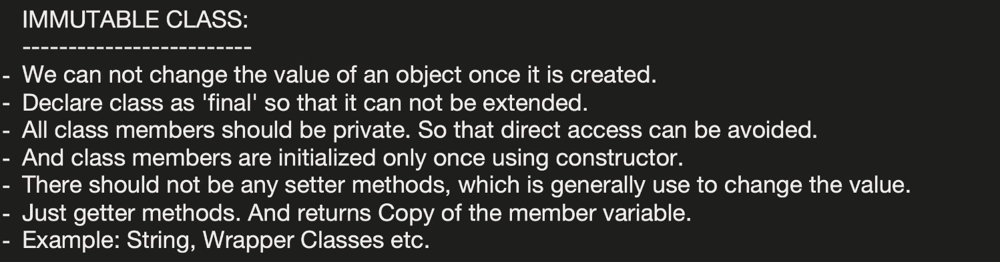

```java
import java.util.Collections;
import java.util.List;

public final class Person {
    private final String name;
    private final int age;
    private final List<String> phoneNumbers;

    // Constructor to initialize the immutable fields
    public Person(String name, int age, List<String> phoneNumbers) {
        this.name = name;
        this.age = age;
        // Create a defensive copy to ensure the original list can't be modified from outside
        this.phoneNumbers = Collections.unmodifiableList(phoneNumbers);
    }

    // Getter methods to access the fields
    public String getName() {
        return name;
    }

    public int getAge() {
        return age;
    }

    public List<String> getPhoneNumbers() {
        return phoneNumbers;
    }

    @Override
    public String toString() {
        return "Person [name=" + name + ", age=" + age + ", phoneNumbers=" + phoneNumbers + "]";
    }
}

public class ImmutableExample {
    public static void main(String[] args) {
        // Create a list of phone numbers
        List<String> phoneNumbers = List.of("123-456-7890", "987-654-3210");

        // Creating an immutable Person object with a list
        Person person = new Person("Alice", 30, phoneNumbers);

        // Accessing the immutable object fields using getter methods
        System.out.println(person);

        // Trying to modify the list or its contents is not possible
        // person.getPhoneNumbers().add("555-555-5555"); // Throws UnsupportedOperationException
    }
}

```