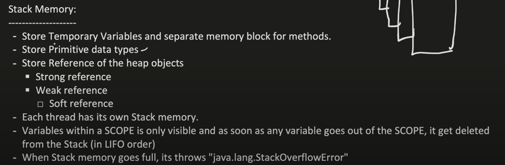
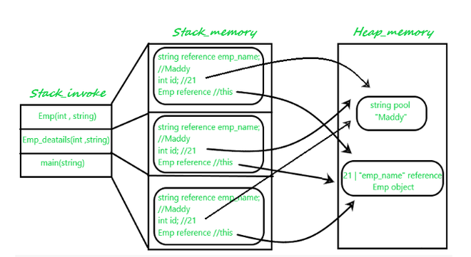

[Created Using Shreyansh + ChatGPT](https://www.youtube.com/watch?v=vz6vSZRuS2M&list=PL6W8uoQQ2c63f469AyV78np0rbxRFppkx&index=10)

#### 2 Types of Memory 

* Heap
  * 

Both Stack and Heap are created by JVM and stored in the RAM
__________
#### What kind of data is Stored in Stack and Heap with Example ? 

Referred from GFG
```java 
class Emp {
    int id;
    String emp_name;

    public Emp(int id, String emp_name) {
        this.id = id;
        this.emp_name = emp_name;
    }
}

public class Emp_detail {
    private static Emp Emp_detail(int id, String emp_name) {
        return new Emp(id, emp_name);
    }

    public static void main(String[] args) {
        int id = 21;
        String name = "Maddy";
        Emp person_ = null;
        person_ = Emp_detail(id, name);
    }
}
```



__________
#### Types of References

##### Summary
| **Aspect**          | **Strong Reference**     | **Weak Reference**        | **Soft Reference**        |
|----------------------|--------------------------|----------------------------|---------------------------|
| **Garbage Collection** | Not collected until explicitly set to `null`. | Collected if no strong reference exists. | Collected only if JVM needs memory. |
| **Use Case**         | Normal references.       | Temporary data, e.g., caching. | Memory-sensitive caches.  |
| **Implementation**   | Default reference type.  | `WeakReference<T>`         | `SoftReference<T>`        |


---

##### 1. Strong Reference
The default type of reference in Java.
> Behavior
- As long as a strong reference exists, the object it references is not eligible for garbage collection.
- Commonly used for normal object references.
> Example
```java
public class StrongReferenceExample {
    public static void main(String[] args) {
        Object obj = new Object(); // Strong reference
        System.out.println(obj);  // Object cannot be garbage collected
    }
}
```

> Garbage Collection


The object referenced by `obj` will only be eligible for garbage collection if `obj` is explicitly set to `null`.

---

##### 2. Weak Reference

Used when you want objects to be garbage collected as soon as they are no longer in active use, even if a weak reference to the object exists.

> Behavior
- Created using `java.lang.ref.WeakReference`.
- The object will be garbage collected when no strong references exist.

>Use Case

Often used in **caches** and **maps** (e.g., `WeakHashMap`) where entries should be removed automatically when not referenced elsewhere.

> Example
```java
import java.lang.ref.WeakReference;

public class WeakReferenceExample {
    public static void main(String[] args) {
        Object obj = new Object(); // Strong reference
        WeakReference<Object> weakRef = new WeakReference<>(obj); // Weak reference

        System.out.println("Before GC: " + weakRef.get()); // Object is accessible

        obj = null; // Remove strong reference
        System.gc(); // Request garbage collection

        System.out.println("After GC: " + weakRef.get()); // Likely null, object collected
    }
}
```

> Garbage Collection

The object is eligible for garbage collection if only weak references exist.

---

##### 3. Soft Reference
Similar to weak references but less aggressively collected. Objects are collected only if the JVM needs more memory.

> Behavior
- Created using `java.lang.ref.SoftReference`.
- Useful for implementing memory-sensitive caches.

> Use Case

Often used for caching purposes where you want to retain objects as long as memory is sufficient.

> Example
```java
import java.lang.ref.SoftReference;

public class SoftReferenceExample {
    public static void main(String[] args) {
        Object obj = new Object(); // Strong reference
        SoftReference<Object> softRef = new SoftReference<>(obj); // Soft reference

        System.out.println("Before GC: " + softRef.get()); // Object is accessible

        obj = null; // Remove strong reference
        System.gc(); // Request garbage collection

        System.out.println("After GC: " + softRef.get()); // Object may still be accessible
    }
}
```

> Garbage Collection

The object is garbage collected only if JVM is running low on memory.

---

##### Heap Memory Structure

Topics to cover
Young Generation
  * Eden
  * Survivor (S0 and S1)
Old Generation
 * Metaspace

 * How Garbage Collector work & clean up the Heap memory with Example


* Types of Garbage Collector
   * Single GC
   * Parallel GC

* CMS (Concurrent Mark and Sweep)
* G1 GC